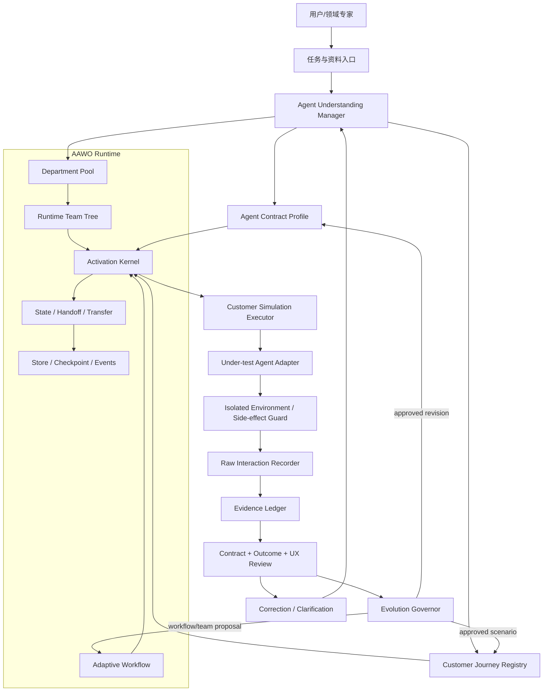

# AAWO Agent Understanding & Customer Simulation Tester

技术方案（初版，面向后续实现）

## 1. 目标与边界

### 1.1 产品目标

在 AAWO 0.6.0.dev41 的动态能力池、临时团队树、可修订工作流、State Transfer、持久化检查点和治理控制面之上，构建一个“Agent 理解与客户仿真测试系统”（暂名 `AAWO-AUCT`）。

它负责：

1. 接入任意领域、任意交互形态的 Agent。
2. 通过文档、接口描述、客户示例、真实交互和用户纠正，逐步建立被测 Agent 的输入输出契约、状态模型、工具边界和使用语义。
3. 按客户真实任务、权限、数据、操作顺序和异常处理方式执行测试。
4. 对失败、阻塞、绕过、隐式修复、反人类流程和数据风险给出可追溯结论。
5. 在证据基础上提出自身测试策略、场景、契约和团队配置的改进，并通过审批、灰度和回滚持续进化。

### 1.2 “任意领域”的准确含义

“任意领域”应实现为领域中立的理解内核和适配器协议，而不是承诺在没有资料、没有权限、没有用户纠正的情况下凭空知道领域规则。系统必须显式区分：

- `observed`：从被测 Agent 实际行为观察到的事实；
- `declared`：由文档、Schema、OpenAPI、工具描述或用户提供的规则声明；
- `confirmed`：经过用户确认或独立证据交叉验证的规则；
- `rejected`：被用户纠正或反例否定的假设；
- `unknown`：当前没有足够证据，不得用于放行。

未确认的内容可以用于生成下一步澄清问题和探索场景，但不能直接作为通过条件。

### 1.3 不在第一版中承诺的内容

- 不承诺替代领域专家对法律、医疗、财务等高风险结果作最终裁定。
- 不把模型自评、静态代码扫描或随机压力测试当作客户验收。
- 不默认连生产系统；生产写操作、资金操作、删除和外部通知必须经过环境隔离与人工批准。
- 不把本地 SQLite 参考内核的回归结果写成远程 Store、容器隔离或真实供应商模型质量已验证。

## 2. 对 AAWO 0.6.0.dev41 的复用与新增

### 2.1 直接复用

| AAWO 能力 | 在测试系统中的用途 |
|---|---|
| DepartmentPool / Agent Blueprint | 注册测试专家、领域专家、适配器专家、证据审计员等可复用能力 |
| Runtime Team Tree | 表达测试团队的权责、授权范围、消息归属和后序释放顺序 |
| Adaptive Workflow | 表达当前测试阶段、就绪门禁、优先级、暂停和并发投影；不把团队树当业务流程 |
| WorkItem / TaskHandoff / Department State | 保存测试任务、交接、当前理解事实、待处理澄清和场景状态 |
| State Transfer | 在“理解”“执行”“审计”“演进”部门之间传递经过契约验证的结果 |
| Store Wave / OCC / owner fencing | 让一次执行、一次结算、一次纠正或一次演进应用不产生半提交 |
| ToolRegistry / Durable Action | 约束浏览器、HTTP、CLI、MCP、数据库和业务工具的权限、幂等与审批 |
| Checkpoint / Runtime Events | 支持崩溃恢复、逐步重放、证据时间线和审计查询 |
| Workflow Optimizer / Team Optimizer | 分别负责测试流程演进和测试团队结构优化，保留现有审批与补偿语义 |

### 2.2 必须新增的能力

1. 被测 Agent Adapter：统一 API、函数、CLI、MCP、浏览器、事件流和组合式 Agent 的调用边界。
2. Agent Contract Model：保存输入、输出、状态、工具、错误、权限、业务规则和客户旅程的版本化模型。
3. Customer Journey Model：从客户任务和真实交互提取可执行场景，不生成脱离语境的随机题。
4. Interaction Recorder：逐步保存原始输入、原始输出、工具调用、环境快照、状态变化和副作用。
5. Evidence Ledger：每个结论绑定证据、哈希、来源、执行器、模型版本、权限和环境。
6. Failure/Friction Classifier：识别失败、阻塞、静默绕过、契约违约和反人类操作。
7. Correction Loop：接收用户纠正，生成差异、影响范围和回归场景，不覆盖旧事实。
8. Evolution Governor：管理提案、审批、灰度、指标、回滚和有害结果冻结。

## 3. 总体架构



执行层的调用对象是客户旅程和当前事实，不是“把所有 Agent 节点跑一遍”。组织树只解决谁负责、谁有权、谁交接、谁释放；测试步骤由客户场景、被测 Agent 的当前契约和真实状态共同决定。

## 4. 核心数据模型

### 4.1 Agent Contract Profile

`AgentContractProfile` 是被测 Agent 的领域中立描述，包含：

- `agent_id / adapter_id / profile_revision`：身份和绑定版本；
- `purpose`：用户目标和可接受结果；
- `channels`：HTTP、OpenAI-compatible、函数、MCP、CLI、浏览器、事件流等；
- `input_contracts`：字段、类型、必填性、默认值、单位、编码、上下文依赖和示例；
- `output_contracts`：结果结构、自然语言与结构化部分、状态码、引用、可见性和终态；
- `session_model`：无状态、会话、长会话、异步 Job、人工接管、恢复方式；
- `tool_contracts`：工具、参数、权限、幂等性、副作用类别和确认要求；
- `error_contracts`：可重试、不可重试、需人工、未知结果和错误恢复；
- `domain_invariants`：单位、顺序、状态迁移、权限、金额、时间、合规和数据保留规则；
- `customer_journeys`：客户目标、前置条件、步骤、观察点、成功定义和可接受失败；
- `friction_rules`：反人类操作的可观察判定条件；
- `evidence_refs`：每个字段对应的声明、观察、纠正和验证证据。

同一字段允许多个候选假设，但只有一个或多个 `confirmed` 版本可进入强放行门禁。Profile 的修订采用单调版本和 supersession，不删除原始观察。

### 4.2 Customer Journey

一个客户场景至少包含：

```json
{
  "scenario_id": "journey.invoice.reconcile.v1",
  "goal": "核对一笔发票并得到可解释的差异结论",
  "actor": {"role": "finance_operator", "permissions": ["invoice.read"]},
  "preconditions": ["fixture.invoice_set=small_2026_07"],
  "steps": [
    {"kind": "user_input", "value_ref": "fixture.invoice_question"},
    {"kind": "observe", "assert": "agent.requests_missing_period_only_if_needed"},
    {"kind": "user_input", "value_ref": "fixture.period"},
    {"kind": "observe", "assert": "result.contains_reconciled_totals"}
  ],
  "success_contract": {"status": "confirmed", "evidence_refs": ["corr_018"]},
  "side_effect_policy": "read_only",
  "source": "customer_trace",
  "revision": 1
}
```

场景来源优先级为：真实客户录屏/请求日志、用户手工复现、业务 SOP、接口示例、领域专家补充、最后才是模型提出的探索场景。模型提出的场景必须标为 `proposed`，不能冒充客户行为。

### 4.3 Test Run 与 Evidence

每次测试保存不可变 `TestRun`：

- 被测 Agent、Adapter、Profile revision、Scenario revision；
- 测试环境、权限、数据夹具、模型/Prompt/工具绑定；
- 每一步的原始输入、原始输出、工具调用、状态快照、时间和副作用；
- 断言结果、失败分类、证据哈希和执行器身份；
- 结论：`PASS / FAIL / BLOCKED / INCONCLUSIVE / NOT_RUN / NEEDS_HUMAN`；
- 是否有重试、修复或人工介入，以及这些动作是否改变了原始结论。

核心规则：原始失败永远保留。后续修复只能创建新 Attempt 或新 Run，不得把失败记录改成成功。`BLOCKED` 不等于 `PASS`，`INCONCLUSIVE` 不等于“默认通过”。

## 5. 被测 Agent Adapter 协议

定义一个最小、可审计的 `UnderTestAdapter`：

```python
class UnderTestAdapter(Protocol):
    def describe(self) -> AdapterDescription: ...
    async def open_session(self, context: SessionContext) -> SessionHandle: ...
    async def send(self, session: SessionHandle, message: InputEnvelope) -> RawObservation: ...
    async def observe(self, session: SessionHandle) -> tuple[RawObservation, ...]: ...
    async def checkpoint(self, session: SessionHandle) -> EnvironmentSnapshot: ...
    async def reset(self, session: SessionHandle, mode: ResetMode) -> None: ...
    async def close(self, session: SessionHandle) -> None: ...
```

Adapter 必须声明：

- 输入输出编码和最大尺寸；
- 身份、租户、权限和数据范围；
- 是否允许真实副作用；
- 如何判定请求已发送、响应已收到、结果未知；
- 如何重置会话和恢复异步 Job；
- 工具调用与外部动作的可观察性；
- 浏览器/CLI 操作的截图、DOM/终端输出或事件证据。

第一阶段实现四类：OpenAI-compatible/HTTP、Python callable、CLI 子进程、MCP/工具调用。浏览器和复杂事件流作为第二阶段适配器，但其证据协议从第一天固定。

## 6. 理解流程：先建模，再测试，再修正

### 阶段 A：资料摄入

导入 OpenAPI/JSON Schema、工具描述、SOP、示例对话、日志、录屏转写、错误样本和用户说明。解析器只生成候选结构，不自动把自然语言当成强契约。

### 阶段 B：契约归纳

`Contract Miner` 对声明与观察做归一化、去重和冲突检测，形成字段级假设。每个假设附带来源和反例；冲突进入 `ClarificationRequest`，由用户选择规则或提供样例。

### 阶段 C：客户旅程重建

`Customer Simulator` 先完成目标、权限、数据、步骤和期望结果，再决定测试输入。它可以提出少量最有信息量的澄清问题，但不得用随机输入代替真实客户任务。

### 阶段 D：受控执行

`Activation Kernel` 只激活前置条件满足、证据足够、权限匹配且没有待审批动作的 WorkItem。执行器通过 Adapter 发出客户级操作，逐步记录原始观察。

### 阶段 E：多重审查

1. 结构审查：Schema、类型、必填字段、状态码、引用和单位。
2. 语义审查：是否完成客户目标，是否遵守领域不变量。
3. 行为审查：是否错误地绕过、伪造、吞掉错误或改变输入语义。
4. 体验审查：步骤数量、术语一致性、恢复路径、错误可行动性、重复输入、等待反馈和数据可见性。
5. 安全审查：权限越界、隐式副作用、敏感数据泄露和不可逆操作。

LLM 评审只能作为独立 evaluator 的一项证据，不能与被测 Agent 共用同一上下文、同一执行器或同一未审核记忆，也不能单独推翻确定性失败。

## 7. “不能悄悄走通”的执行纪律

### 7.1 状态机

每个场景步骤使用显式状态：

`planned -> ready -> running -> observed -> validated -> settled`

异常分支使用：

`blocked / failed / unknown / needs_human`

不允许从 `failed` 直接跳到 `settled`。任何修复、重试、替换输入或人工操作都会产生新的 Attempt，并在报告中显示因果关系。

### 7.2 重试规则

- 只允许 Adapter 声明的只读、无副作用、可证明幂等的重试；
- 有副作用的超时标为 `UNKNOWN`，等待证据或人工仲裁；
- 协议解析修复只能修复测试系统自己的解析，不得修复被测 Agent 输出后再当作原始输出；
- 缺字段、状态码不符、工具调用失败和前置条件缺失必须原样记录；
- 如果需要测试系统临时绕过才能继续，结论至少为 `BLOCKED`，并单独记录“测试工具绕过”，不能产生绿色结果。

### 7.3 证据等级

`E0` 模型推测，`E1` 静态声明，`E2` 单次观察，`E3` 重复观察，`E4` 用户确认或独立领域证据，`E5` 在隔离环境完成的客户旅程闭环。强通过条件至少需要 `E4`，关键业务成功还需 `E5`。

## 8. 反人类操作识别

反人类不是“模型觉得不舒服”，而是可观察的摩擦事实。系统输出 `HumanFrictionFinding`，包含规则、步骤、证据和影响范围。第一版规则包括：

- 为完成简单目标要求无业务理由的重复输入或重复确认；
- 术语、单位、字段名或状态在同一旅程中不一致；
- 失败提示没有说明原因、修复动作或保留的用户数据；
- 隐藏前置条件，只在最后一步才暴露；
- 允许用户提交明显无效数据，却延迟到不可逆步骤才报错；
- 成功结果不可验证，或 Agent 声称完成但没有对应观察证据；
- 无法撤销、重试、恢复或转人工，且任务会丢失已输入数据；
- 权限提示与实际能力不一致，或要求客户使用不必要的内部概念；
- 交互顺序违反客户自然目标，迫使客户先完成与目标无关的操作；
- 长时间无进度、无结果或无状态反馈，导致客户无法判断是否继续操作。

客观指标包括步骤数、重复字段数、失败恢复步数、数据丢失、等待区间、首次错误位置和人工接管次数。主观评价必须由用户/领域专家标注，并与客观证据分开。

## 9. 用户纠正与持续理解

用户可在任意运行节点提交纠正：

```json
{
  "correction_id": "corr_018",
  "target": "output_contract.total_amount",
  "old_hypothesis": {"type": "number", "unit": "CNY"},
  "corrected_fact": {"type": "string", "format": "decimal", "unit": "CNY", "scale": 2},
  "reason": "客户系统保留两位小数字符串，不能按浮点比较",
  "evidence_refs": ["trace_117", "sample_22"],
  "regression_scenarios": ["journey.invoice.reconcile.v1"]
}
```

纠正处理流程：

1. 冻结受影响的强断言；
2. 生成 old/new diff 和受影响场景、工具、Transfer、评审规则；
3. 将旧假设标为 `superseded`，不删除旧证据；
4. 重新执行最小回归集合，再执行风险相关的扩展集合；
5. 用户确认后将新事实提升为 `confirmed`；
6. 把纠正沉淀为限定 scope 的知识，不跨客户、项目或安全域泄漏。

## 10. 自进化机制

### 10.1 三条演进通道

1. `Understanding Evolution`：新增或修正被测 Agent 的契约、状态和领域知识。
2. `Test Evolution`：新增客户场景、断言、反例、摩擦规则和回归优先级。
3. `Orchestration Evolution`：调整 AAWO 测试团队、工作流门禁、并发和能力招聘。

### 10.2 受控闭环

```text
执行证据 -> 反思/冲突检测 -> EvolutionProposal
-> 策略评估 -> 人工审批或低风险自动灰度
-> shadow/canary -> 指标比较 -> 应用新版本或回滚
```

自进化的硬规则：

- 原始交互、原始失败和用户纠正不可变；
- 修改“预期结果”比修改“执行流程”风险更高，默认必须人工批准；
- 任何能使失败变成通过的变更必须标记为高风险，不得自动应用；
- 自动演进只允许添加低风险探索场景、排序优化或同部门未启动工作重分配，且必须有可逆补偿；
- Contract Registry、Evaluator Registry、Side-effect Policy、权限和安全规则只能经人工审批版本化；
- 出现 `harmful`、数据丢失、权限越界或连续回归下降时，冻结同类自动演进并要求人工处理；
- 每个应用版本保留 before/after、证据、批准人、指标、灰度范围和回滚锚点。

### 10.3 与 AAWO 自进化的映射

- 绑定 `workflow_optimization` 的 Agent 只能提出测试工作流修订。
- 绑定 `team_optimization` 的 Agent 只能提出测试团队结构变化。
- 新增 `quality_evolution` 能力，负责把证据整理成契约/场景/评审规则提案；控制面负责审批和应用，普通 Agent 不能直接改 Registry。
- 继续使用 AAWO 的 revision、CAS、EvidenceRef、OptimizationDecision、TeamChangeReceipt、CompensationReceipt 和 postorder release。

## 11. 持久化对象与接口

建议第一阶段以 AAWO Store 的 `runtime_record` 扩展落地，成熟后提升为正式 Store Contract：

`agent_profile`、`contract_revision`、`customer_scenario`、`adapter_binding`、`test_run`、`interaction_event`、`finding`、`correction`、`evolution_proposal`、`evolution_decision`、`evolution_outcome`、`evaluator_binding`。

建议控制面 API：

- `POST /under-test/agents`：注册 Agent 和 Adapter；
- `POST /under-test/profiles/{id}/ingest`：导入文档、Schema、样例和日志；
- `POST /under-test/sessions`：创建理解/测试会话；
- `POST /under-test/scenarios`：创建或提交客户旅程；
- `POST /under-test/runs`：执行一个或一组场景；
- `GET /under-test/runs/{id}`：读取逐步证据和结论；
- `POST /under-test/corrections`：提交纠正并生成回归计划；
- `GET /under-test/findings`：按失败、阻塞、摩擦和安全风险查询；
- `POST /under-test/evolution/{proposal_id}/decision`：批准、拒绝、灰度或回滚。

CLI 采用同一控制面，不额外实现绕过审批的“快捷测试”路径。

## 12. 测试团队蓝图

首批建议注册以下蓝图，由 Workforce Steward 按能力动态招聘：

| 蓝图 | 能力 | 主要职责 |
|---|---|---|
| `test-director` | `test-orchestration` | 维护目标、风险、范围和最终结论 |
| `contract-miner` | `contract-inference` | 从声明、样例和观察归纳输入输出契约 |
| `domain-interviewer` | `clarification` | 向用户提问并记录领域确认 |
| `customer-simulator` | `customer-journey` | 按客户角色、权限、数据和顺序执行 |
| `environment-operator` | `sandbox-operation` | 管理夹具、会话、快照、重置和副作用门禁 |
| `protocol-verifier` | `contract-validation` | 校验结构、状态、错误和工具协议 |
| `outcome-reviewer` | `domain-outcome-review` | 判断客户目标是否真正完成 |
| `ux-friction-reviewer` | `human-factors` | 识别反人类操作并量化摩擦 |
| `adversarial-reviewer` | `negative-path` | 做有业务意义的边界、权限和恢复测试 |
| `evidence-auditor` | `evidence-audit` | 检查证据完整性、来源和结论是否越权 |
| `quality-evolution` | `quality-evolution` | 形成契约、场景和评审规则演进提案 |

这些 Agent 是能力池中的长期蓝图；一次测试只招聘当前需要的实例，空闲实例可在同一 memory scope 内复用。团队树不承载客户旅程的业务顺序。

## 13. 交付阶段与验收门槛

### P0：最小可用内核

支持 HTTP/OpenAI-compatible、Python callable、CLI 三类 Adapter；完成 Profile、Scenario、Interaction、Evidence、Run 状态和 fail-closed 规则。验收：一次真实客户旅程可重放，失败不会被重试或解析修复伪装成通过。

### P1：用户纠正闭环

支持字段级纠正、澄清请求、supersession、最小回归集合和报告差异。验收：用户纠正一个输入或输出字段后，旧结论保留，新 Run 能解释变化原因。

### P2：多轮与体验审查

支持长会话、异步 Job、MCP/工具调用、浏览器证据、权限矩阵和摩擦指标。验收：能识别至少一类流程阻塞、一类错误恢复缺陷和一类隐式副作用。

### P3：受控自进化

支持 Proposal、策略评估、人工批准、shadow/canary、指标和回滚。验收：一次演进能改善已确认场景，同时保留原始失败和可恢复旧版本；有害结果会冻结后续自动演进。

### P4：生产化扩展

接入 PostgreSQL/消息总线/隔离执行环境、租户和密级治理、远程故障矩阵以及真实供应商模型。每种基础设施单独验收，不继承 SQLite 本地结果。

## 14. 关键指标

- 契约覆盖率：已确认输入、输出、状态、工具和错误项 / 发现项；
- 客户旅程覆盖率：已执行真实来源场景 / 已确认场景；
- 证据完整率：每个结论具备原始交互、环境、版本和哈希的比例；
- 静默绕过率：测试系统或被测 Agent 绕过失败的次数，目标为零；
- 误放行率：独立人工复核发现的错误 PASS；
- 阻塞识别率：真实阻塞被标为 `BLOCKED` 而非 `PASS` 的比例；
- 纠正收敛时间：用户纠正到最小回归完成的时间；
- 反人类缺陷：每个客户旅程的步骤、重复输入、恢复成本、数据丢失和人工接管；
- 演进收益：通过场景成功率、错误恢复率、摩擦指标与回归损失的变化；
- 演进安全：自动提案被拒绝、有害、回滚和冻结的次数。

## 15. 第一轮实现建议

第一轮不改 AAWO 核心生命周期语义，新增独立包 `aawo_agent_tester`，通过 AAWO 公共 API 接入：

```text
aawo_agent_tester/
  adapters/          # http, openai, callable, cli, mcp, browser
  contracts/         # profile, hypotheses, schemas, error contracts
  journeys/          # customer journey and fixture registry
  execution/         # session, attempt, reset, side-effect guard
  evidence/          # recorder, ledger, hashes, provenance
  review/             # contract, outcome, friction, security evaluators
  evolution/         # proposal, policy, canary, rollback
  api/                # control-plane facade and CLI
  tests/              # deterministic contracts and customer journey fixtures
```

首个可演示闭环应选一个低风险、可重置的真实 Agent（例如只读查询或内部知识问答），同时故意准备一个“输出缺字段”和一个“客户需要绕路才能完成”的案例，以证明系统能停在失败/阻塞并给出证据，而不是只演示成功路径。

## 16. 结论

这套方案把 AAWO 的强项用于“谁来理解、谁来执行、谁来审计、谁来演进”，把被测 Agent 的真实输入输出和客户旅程放在独立的契约与证据层。系统的核心竞争力不是生成更多测试样例，而是：在证据不足时主动澄清，在真实失败时停住，在用户纠正后可解释地重建理解，并通过受控自进化逐步提高测试质量，同时永远保留失败、阻塞和回滚路径。
